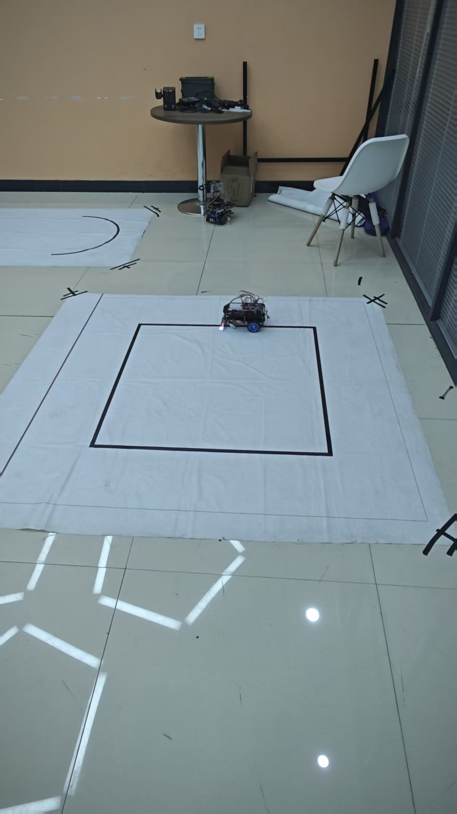
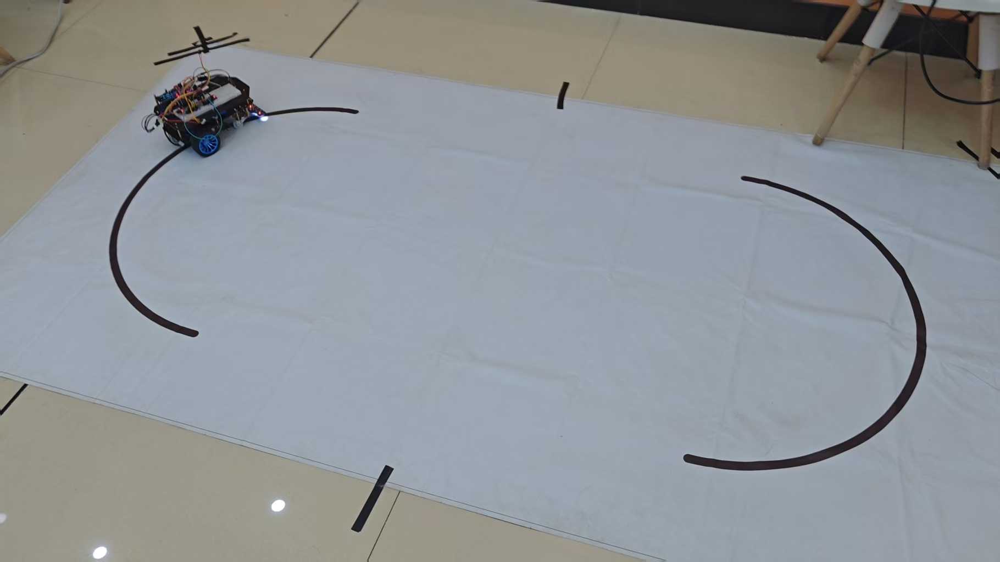

# STM32F103C8T6 智能循迹小车

基于 STM32F103C8T6（Cortex-M3）的四轮智能循迹小车，融合 **7 路灰度循迹传感器** 与 **MPU6050 六轴姿态传感器**，实现了循迹跑圈、自动计数、陀螺仪辅助转向、多圈行驶等多项功能。代码基于标准外设库（StdPeriph）编写，使用 Keil uVision5 编译，注释采用 GBK 编码。

## 实物图片

<p align="center">
  
  
</p>

## 功能特性

- **5 种运行模式**，通过按键循环切换，OLED 实时显示当前模式与状态
- **7 路灰度传感器循迹**，加权误差计算 + PD 控制（Kp/Kd 可调）
- **MPU6050 航向角（Yaw）积分**，四元数姿态解算，断电前累计航向
- **陀螺仪辅助转向**，在出线/断线时依据目标航向角修正方向
- **编码器测速**（TIM2 / TIM3 编码器模式），用于闭环控制
- **节点自动计数**，OLED 显示当前节点数与累计航向角
- **自动倒计时发车**，跑完设定圈数（或到达终点）后自动停车并蜂鸣提示
- **OLED 菜单界面**，显示模式、状态、节点数、累计角度

## 模式说明

| 模式 | 名称 | 说明 |
| --- | --- | --- |
| Mode 1 | 循迹跑圈 | 循迹行驶，每经过一个弯道计 1 个节点，跑完设定圈数（1~5 圈可调）后自动停止 |
| Mode 2 | 循迹停线 | 循迹行驶，检测到终点横线后自动停车 |
| Mode 3 | 单圈陀螺仪 | 循迹 + 航向角修正，结合弯道角度判断消除误检，跑完 1 圈（4 节点）停止 |
| Mode 4 | 特殊路径 | 针对特定赛道（A→C、B→D 段）使用航向角控制转弯，配合循迹行驶，4 节点后停止 |
| Mode 5 | 多圈陀螺仪 | 循迹 + 航向角规划（多段目标角度），跑完 4 圈（16 节点）停止 |

**操作方式**：上电后默认进入 Mode 1（1 圈），短按按键依次切换模式（Mode 1 下按 1~5 次选择圈数）；倒计时（Mode 1 为 3 秒，其余模式为 2 秒）结束后自动发车。

## 硬件清单

| 模块 | 型号/说明 |
| --- | --- |
| 主控 | STM32F103C8T6 最小系统板 |
| 姿态传感器 | MPU6050 六轴（I2C） |
| 显示 | 0.96 寸 OLED（I2C，4 针） |
| 循迹传感器 | 7 路灰度/红外循迹模块 |
| 电机驱动 | 双路 H 桥驱动（TB6612 等） |
| 电机 | 带编码器直流减速电机 x2 |
| 其它 | 有源蜂鸣器（高电平触发）、按键、LED、电池 |

## 引脚连接

| 外设 | 引脚 / 说明 |
| --- | --- |
| 按键 KEY | PB1 |
| PWM（TIM1_CH1 / TIM1_CH2） | PA8 / PA9 |
| 电机方向（左） | PA4 / PA5 |
| 电机方向（右） | PB10 / PB11 |
| 编码器（TIM3，左） | PA6 / PA7 |
| 编码器（TIM2，右） | PA0 / PA1 |
| I2C（OLED / MPU6050 共用） | SCL = PA2，SDA = PA3 |
| 有源蜂鸣器（高电平触发） | PB15 |
| LED1 / LED2 | PB13 / PB14 |

循迹传感器（7 路，从左到右）：

| 位置 | L3 | L2 | L1 | M | R1 | R2 | R3 |
| --- | --- | --- | --- | --- | --- | --- | --- |
| 引脚 | PA12 | PA11 | PA10 | PA15 | PB3 | PB4 | PB5 |

## 目录结构

```
car/
├── Hardwork/            # 硬件驱动层（电机、编码器、循迹、MPU6050、OLED 等）
├── User/                # 用户程序（main.c 主逻辑、中断服务函数）
├── system/              # 系统层（软件延时）
├── library/             # STM32F10x 标准外设库
├── start/               # 启动文件、内核文件、寄存器定义
├── images/              # 实物图片
└── project.uvprojx      # Keil 工程文件
```

## 开发环境与使用

1. **软件**：Keil uVision5（需安装 Keil.STM32F1xx_DFP 器件包）
2. **打开工程**：双击 `project.uvprojx`
3. **编译下载**：使用 ST-Link / DAP-Link 等下载器烧录到 STM32F103C8T6
4. **调试信息**：默认在 Debug 模式下开启，可配合串口/仿真器查看

> 提示：源码注释为 GBK 编码，若在部分编辑器中显示乱码，请将文件编码切换为 GBK/GB2312。

## 控制说明

- 循迹误差：7 路传感器按位置加权（L3=-30 ... R3=+30），多点触发时取平均值
- PD 控制：`Turn = Kp * Error + Kd * (Error - PrevError)`，Kp=1.0，Kd=1.4
- 速度限制：正向最大 95，反向最小 -60；断线时依据历史误差保持转向
- 航向积分：将 Yaw 增量累加（处理 ±180° 跳变），用于陀螺仪辅助转向

## 鸣谢

- 江协科技开源 OLED 驱动（[jiangxiekeji.com](https://jiangxiekeji.com)）
- STM32F10x 标准外设库（STMicroelectronics）

> 本项目为个人初次学习阶段的作品，代码难免有不足之处，欢迎各位大佬指正交流。

## License

本项目仅供学习交流使用，遵循 MIT 协议开源。
